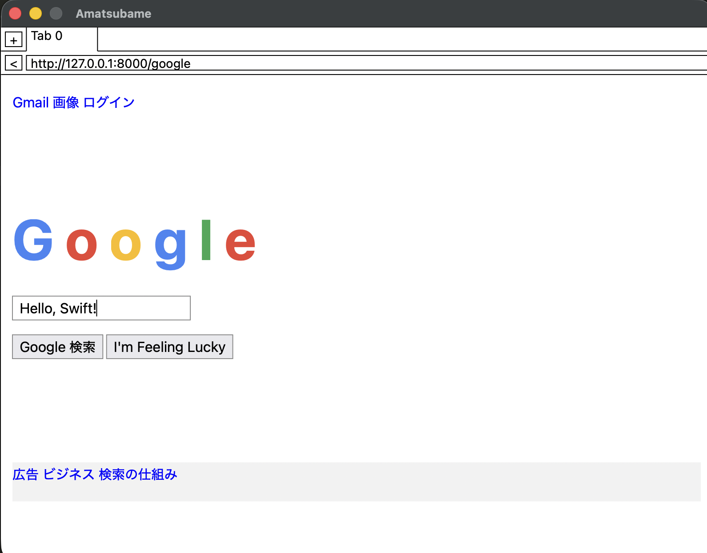

# Amatsubame

A toy web browser implemented in Swift, following [Web Browser Engineering](https://browser.engineering/) by Pavel Panchekha & Chris Harrelson.



## Build

```bash
swift build
```

## Usage

```bash
swift run Amatsubame https://browser.engineering/index.html
```

## End-to-end testing

`TestServer` is a small local HTTP server for exercising the browser by hand,
including form submission. Run it in one terminal and point the browser at it in
another:

```bash
swift run TestServer                          # default port 8000; for another port: swift run TestServer 9000
swift run Amatsubame http://127.0.0.1:8000/   # in another terminal
```

Open `http://127.0.0.1:8000/` for the index of test pages. The
`/google` page shown in the screenshot above is a good end-to-end showcase of
the current rendering features.

## Requirements

- macOS 12+
- Swift 6.0+
